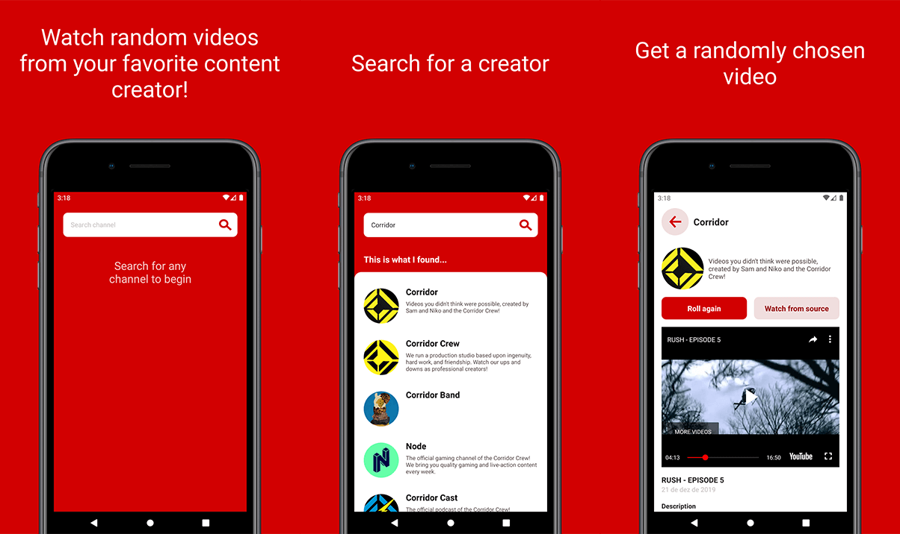

# Random Video

<p align="center">
  
</p>

__Watch random videos from your favorite content creators!__

Watch random videos from your favorite content creators!

Use this app when you want to watch something from a content creator you like, but you don't know what to watch. Surprise yourself!

Given a channel, it will then randomly choose one of the latest 50 videos for you.

<p align="center">
  <a href="https://play.google.com/store/apps/details?id=com.randomvideo">
    
  </a>
</p>

<p align="center">
  
</p>

## Development

To setup a local environment:

- Clone the repository
- Run the `yarn` command to install dependencies
- Launch the app with `yarn android` or `yarn ios`

## Releases

Releases are managed through [Microsoft's AppCenter](https://appcenter.ms/)

Pushing to the `staging` branch will trigger the staging build, shich will be distributed to all members of the project.

Pushing to the `master` branch will tigger the master build, which will publish a new version on Google Play. Ideally, anything must go through staging before merging into master.

## Manually build Android release

Run gradle build inside `android` folder to generate final aab: `gradlew clean bundleRelease`

### Manually install on device

Requires [Google's bundletool](https://github.com/google/bundletool/releases)

After running the release build, use the following commands to build a signed `apk`:

```shell
java -jar bundletool-all-1.3.0.jar ^
build-apks ^
--bundle=app/build/outputs/bundle/release/app-release.aab ^
--output=app-release.apks ^
--ks=your_keystore.keystore ^
--ks-key-alias=your_keystore_alias ^
--ks-pass=pass:keystore-pass
```

A file named `app-release.apks` will be created, shich can be installed on the device with:

```shell
java -jar bundletool-all-1.3.0.jar ^
install-apks ^
--adb=F:\\AndroidSdk\\platform-tools\\adb.exe ^
--apks=app-release.apks
```

Change the keystore parameters to your own environment ([more info here](https://reactnative.dev/docs/signed-apk-android)).
